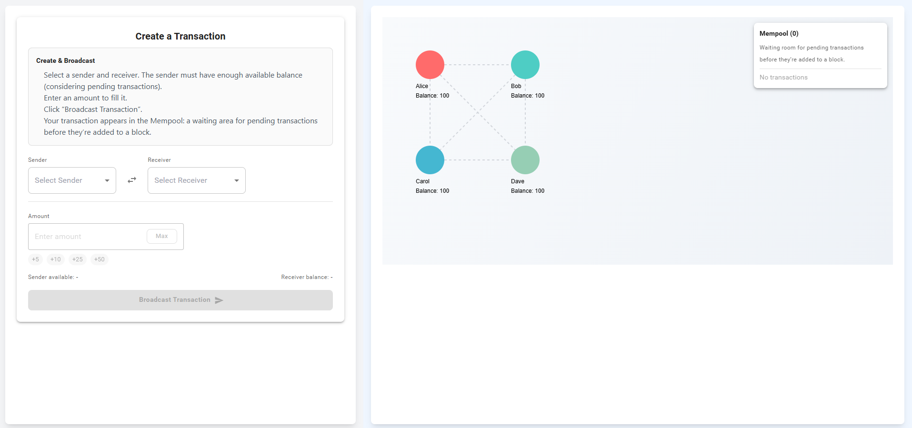
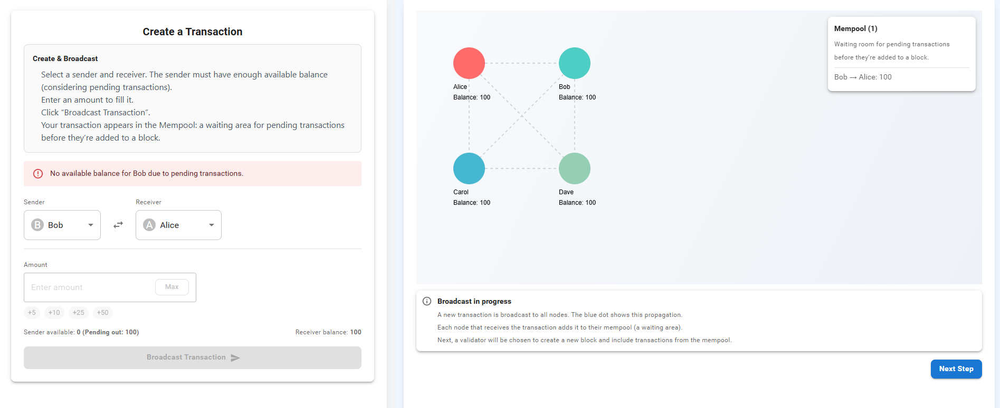
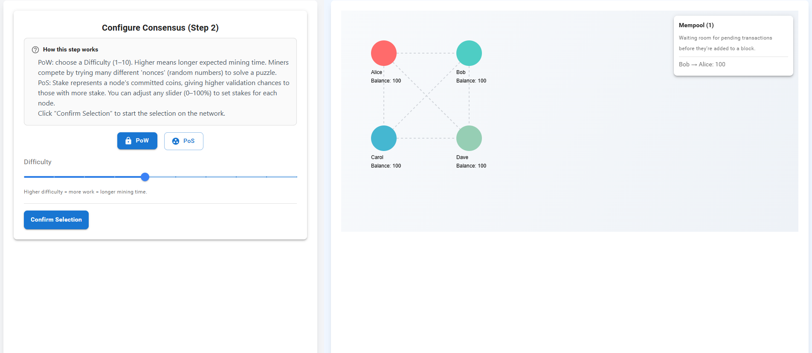
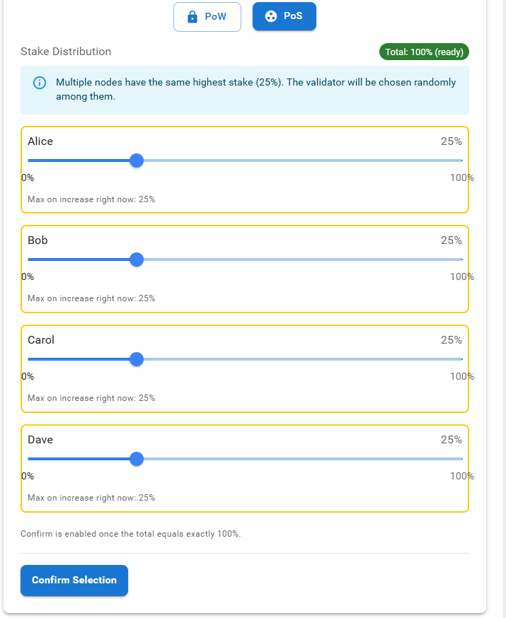
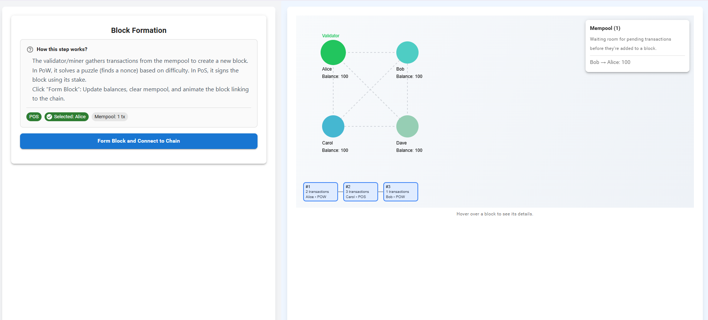
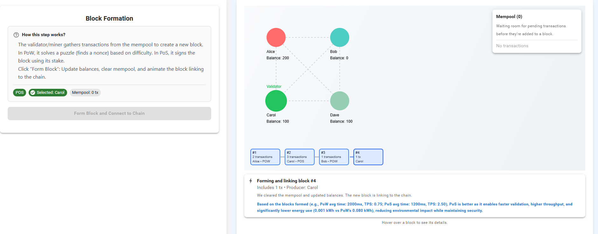

<h3>Procedure</h3>

In this simulation, we will explore two different consensus algorithms: Proof of Work (PoW) and Proof of Stake (PoS).

<b>Step 1:</b> Read the instructions carefully, choose a sender and receiver, enter an amount for the transaction, and click the <b>"Broadcast Transaction"</b> button to initiate the transaction. You can add multiple transactions, and they will be added to the mempool as pending transactions.

Observe the animation on the right panel. The transactions will be shown in the mempool. Click the <b>"Next"</b> button to move to the next step.

<b>Step 2:</b>Choose one of the options: <b>PoW</b> or <b>PoS</b>.  
For <b>PoW</b>, you can set the <b>Difficulty</b> (1–10). A higher difficulty means a longer expected mining time. Miners compete by trying many different 'nonces' (random numbers) to solve the puzzle.

For <b>PoS</b>, you will see the stakes of each node. You can adjust the stake values to influence validator selection and then click the <b>"Confirm Selection"</b> button.

Observe the results:  
- In <b>PoW</b>, a higher difficulty leads to a longer mining time.  
- In <b>PoS</b>, nodes with higher stakes have a greater chance of becoming the validator.

<b>Step 3:</b>Read the instructions and click the <b>"Form Block and Connect Chain"</b> button. Observe the updated blockchain after the transaction is added.

Hover over the blocks to view their details and observe the updated network after the transaction occurs.

