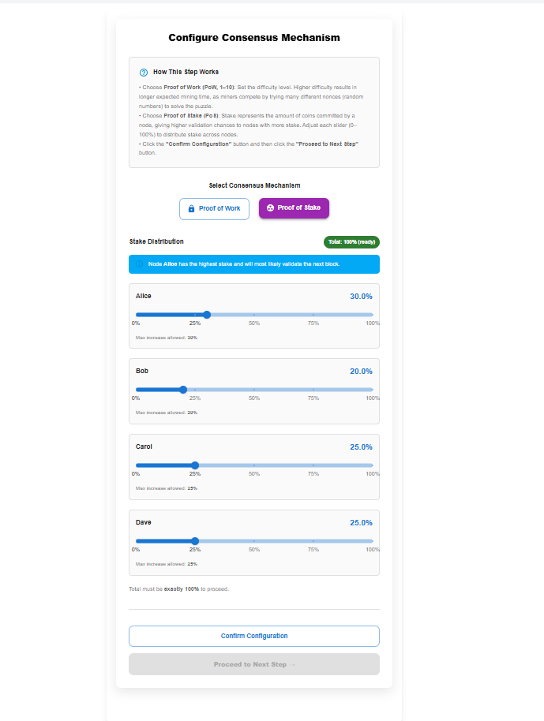
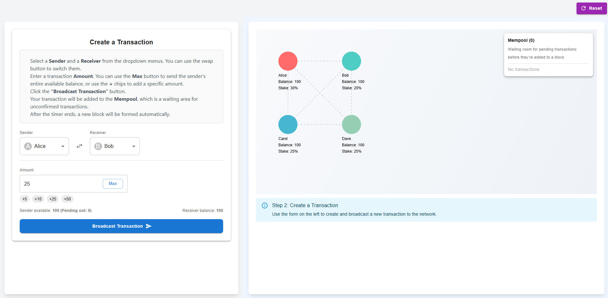
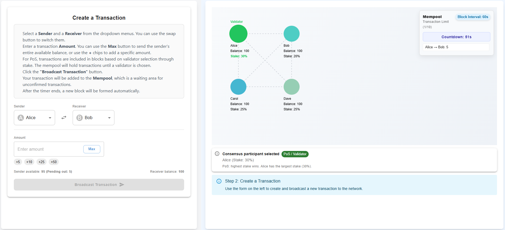
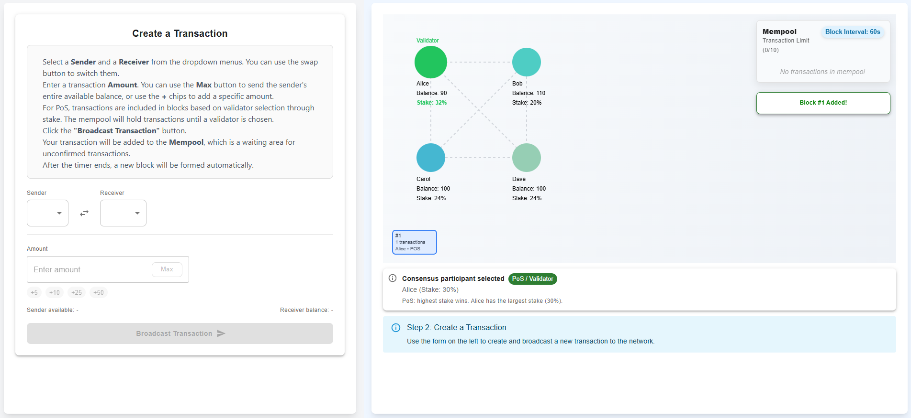
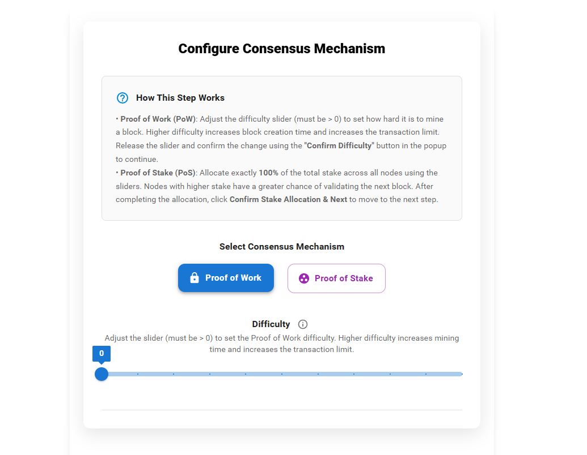
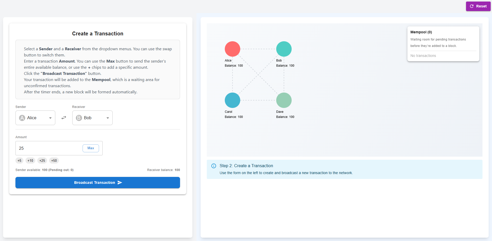
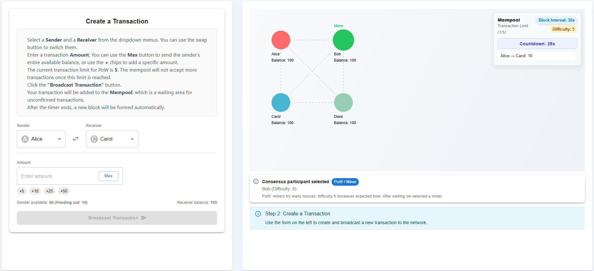
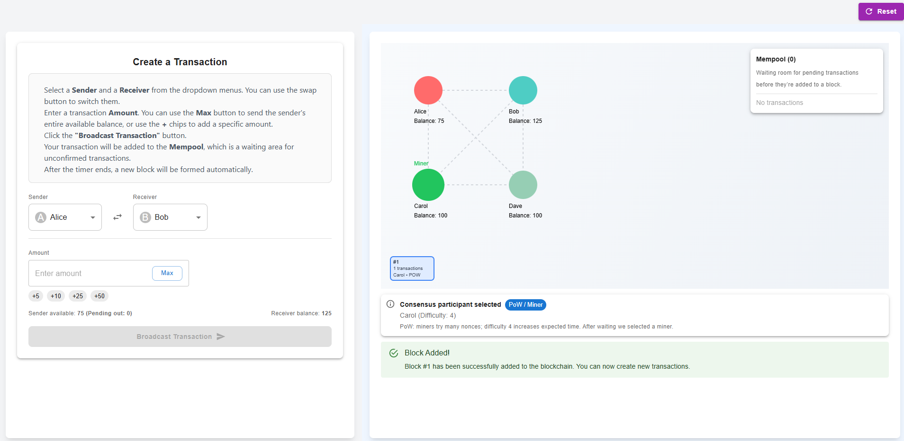

In this simulation, we will explore two different consensus algorithms: Proof of Work (PoW) and Proof of Stake (PoS).

#### Proof of Stake (PoS) Workflow

This simulation demonstrates how Proof of Stake (PoS) selects a validator based on stake distribution and automatically creates blocks from pending transactions.

##### Step 1: Configure Proof of Stake

- Select Proof of Stake (PoS) as the consensus mechanism.
- Distribute stake percentages among all nodes (Alice, Bob, Carol, and Dave).
  - The total stake must be exactly 100% to proceed.
  - Nodes with higher stake have a higher chance of being selected as the validator.
- The system displays a message indicating which node is most likely to validate the next block based on stake.
- Click **Confirm Stake Allocation & Next** to initialize the network.

*At this stage, the network is configured for stake-based validator selection.*

##### Step 2: Create and Broadcast a Transaction

- Use the **Create a Transaction** panel on the left:
  - Select a Sender and Receiver.
  - Enter the transaction amount (or use the quick-add buttons).
- Click **Broadcast Transaction**.
- The transaction is added to the mempool, which temporarily stores pending transactions.

*Broadcasting the first transaction automatically starts the block interval timer.*

##### Step 3: Validator Selection and Block Countdown

- Once at least one transaction is in the mempool:
  - A block countdown timer starts (shown as **Block Interval: 60s**).
  - You may add more transactions while the timer is running.
- When the timer ends:
  - A validator is selected automatically based on stake percentage.
  - The selected validator is:
    - Highlighted in green
    - Labeled as **Validator**
  - A message confirms the selected participant and explains why they were chosen (highest stake).

*In PoS, validators are chosen probabilistically, with higher stake increasing selection likelihood.*

##### Step 4: Block Creation and State Update

- After validator selection:
  - The validator creates a new block using all transactions in the mempool.
  - The block is added to the blockchain.
  - Sender and receiver balances are updated.
  - Stake percentages are recalculated based on updated balances.
  - The mempool is cleared and ready for new transactions.
- A confirmation message appears indicating **Block #1 Added**.

*The system is now ready for the next transaction and block cycle.*

#### Proof of Work (PoW) Workflow

This simulation demonstrates how Proof of Work (PoW) enforces a mining delay using difficulty and how blocks are created automatically after the countdown completes.

##### Step 1: Configure Proof of Work

- Select Proof of Work (PoW) as the consensus mechanism.
- Set the Difficulty level using the slider.
  - Increasing difficulty:
    - Increases the block interval (mining time).
    - Reduces the maximum number of transactions allowed in the mempool.
- The selected difficulty value is displayed below the slider.
- Click **Confirm Difficulty** (popup) and proceed to the next step.

*This step initializes the network with a difficulty-based mining delay.*

##### Step 2: Create and Broadcast a Transaction

- Use the **Create a Transaction** panel:
  - Select a Sender and Receiver.
  - Enter the transaction amount (or use quick-add buttons).
- Click **Broadcast Transaction**.
- The transaction is added to the mempool, which temporarily stores pending transactions.
- The mempool enforces a transaction limit based on the selected difficulty.

*Broadcasting the first transaction automatically starts the mining countdown.*

##### Step 3: Mining Countdown and Miner Selection

- Once the mempool contains at least one transaction:
  - A countdown timer appears (e.g., **Countdown: 25s**).
  - The countdown duration depends on the selected difficulty.
- During this time:
  - All nodes are treated as potential miners.
  - Additional transactions can be added until the mempool limit is reached.
- When the timer ends:
  - One node is selected as the miner.
  - The selected miner is highlighted in green and labeled **Miner**.
  - A message explains the miner selection and difficulty used.

*In this simulation, PoW mining is represented as a time-based delay, not actual hash computation.*

##### Step 4: Block Creation and Network Update

- After miner selection:
  - The miner creates a new block using all transactions in the mempool.
  - The block is added to the blockchain.
  - Sender and receiver balances are updated.
  - The mempool is cleared.
- A confirmation message appears indicating **Block #1 Added**.

*The system is now ready for the next mining cycle.*