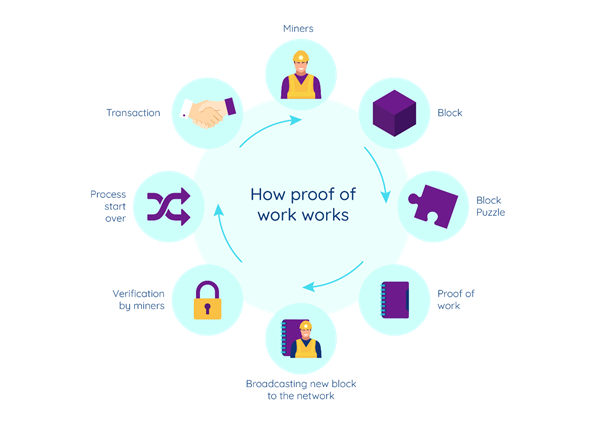
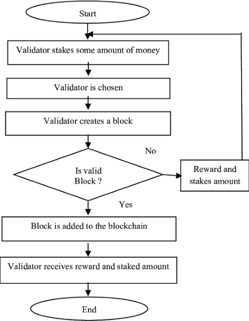

<h3>Theory</h3>
<b>

Consensus Algorithm

</b>

A <b>consensus algorithm</b> is a procedure used in blockchain networks to ensure that all peers agree on the current state of the distributed ledger. It guarantees that every new block added to the blockchain is the single, agreed-upon version of the truth. Without consensus, multiple conflicting versions of the blockchain could exist.

Some of the most common consensus algorithms include:
 1. Proof of Work (PoW)
 2. Proof of Stake (PoS)

<b>

Proof of Work (PoW)

</b>

<b>Proof of Work</b> is a consensus mechanism where miners compete to solve a complex mathematical puzzle to validate transactions and add a new block to the blockchain. The process works as follows:

<ol>
  <li><b>Transaction Broadcast:</b> Users initiate transactions, which are collected in a pool called the <b>mempool</b> (a waiting area for pending transactions).</li>
  <li><b>Mining Competition:</b> Miners select pending transactions and begin solving a cryptographic puzzle by repeatedly changing a random value called a <b>nonce</b> (a number used only once).</li>
  <li><b>Hash Target:</b> Miners must find a hash value lower than a network-defined <b>target</b>. The difficulty level determines how hard this is—the higher the difficulty, the longer it takes.</li>
  <li><b>Winner Announcement:</b> The first miner to find the correct nonce broadcasts the solution to the network.</li>
  <li><b>Block Validation:</b> Other nodes verify the solution. If it’s correct, the block is added to the blockchain.</li>
  <li><b>Reward:</b> The successful miner receives a block reward and transaction fees.</li>
</ol>

PoW is highly secure because altering a block would require re-mining all subsequent blocks, which demands enormous computational power. However, it consumes significant energy, raising environmental concerns.

<b>

Proof of Stake (PoS)

</b>

<b>Proof of Stake</b> is an energy-efficient alternative to PoW. Instead of competing through computational power, validators are chosen to create new blocks based on the amount of cryptocurrency they <b>stake</b>. The process works as follows:

<ol>
  <li><b>Transaction Pool:</b> Pending transactions are collected in a <b>mempool</b>, similar to PoW.</li>
  <li><b>Validator Selection:</b> A <b>validator</b> (a node responsible for creating and validating blocks) is chosen based on the amount of cryptocurrency they stake. The higher the stake, the greater the chance of selection.</li>
  <li><b>Block Proposal:</b> The selected validator creates and proposes a new block containing pending transactions.</li>
  <li><b>Block Validation:</b> Other validators verify the block. If a majority agrees, the block is added to the blockchain.</li>
  <li><b>Rewards & Penalties:</b> Validators earn rewards for honest behavior. If they act maliciously, part of their staked funds is deducted — this penalty is called <b>slashing</b>.</li>
</ol>

PoS is more energy-efficient and scalable compared to PoW. Since validators have something at stake, they are incentivized to act honestly to avoid losing their locked funds.

