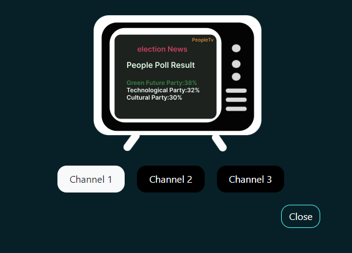

<u><h3>Procedure</h3></u>

In this simulation, we will explore two different consensus algorithms, Proof of Work (PoW) and Proof of Stake (PoS), within the context of an election use case.

You have the option to choose between PoW and PoS, which will be simulated in the context of an election scenario.

In the PoW scenario:

<u>
<b>Verifying the Legitimacy of Votes</b>
</u>

<ol>
    <li>Read the instructions carefully and click the 'Start' button to begin the process.</li>
    <li>You will encounter a voter login page. Fill in the required information and click the 'Login' button to start the simulation.</li>
</ol>

<u>
<b>Preventing Double Voting</b>
</u>

<ol start="3">
    <li>Observe the message indicating that the token has been generated, and a timer will commence. Click 'Close' to proceed to the next step.</li>
</ol>

<u>
<b>Securing the Electoral Process</b>
</u>

<ol start="4">
    <li>Observe the voting machine for a green light, indicating it's tamper-free. If you see a red light, click the 'Report' button to proceed.</li>
</ol>

<ol start="5">
    <li>If the machine displays a red light, signaling tampering, click the 'Report' button to access the issue reporting interface.</li>
</ol>

<ol start="6">
    <li>Choose your issue, then click 'Fix Issue' to continue.</li>
</ol>

<ol start="7">
    <li>Authorities will receive a notification.</li>
</ol>

<ol start="8">
    <li>Click to access the login portal for machine inspection. Enter the required information and proceed to log in.</li>
</ol>

<ol start="9">
    <li>To complete machine verification, mark the checkbox and click 'Submit' to proceed.</li>
</ol>

<ol start="10">
    <li>After successful verification, a confirmation box will appear, confirming the machine is tamper-free and safe to use.</li>
</ol>

<ol start="11">
    <li>The replaced voting machine will display a green light, indicating it's tamper-free and ready for your vote.</li>
</ol>

<u>
<b>Public Verification</b>
</u>

<ol start="12">
    <li>After voting, a table with your name, time, and vote status will be shown for public verification, marking the end of the process.</li>
</ol>

(Please note that the tampering condition is randomly assigned. To experience both scenarios, you can refresh the process. Remember to read the instructions carefully and proceed through each step.)

In the PoS scenario:

<u><b>
Stakeholder Influence
</b></u>

<ol>
    <li>Three channels featuring election news are given. Students can explore and review the content by clicking on the channel button. Click the 'Close' button to proceed to the next step.</li>
</ol>

<u><b>
Incentivizing Participation
</b></u>

<ol start="2">
    <li>Examine the election manifestos of the three parties provided, and choose the one that resonates most with you.</li>
</ol>

<u><b>
Avoiding Concentration of Power
</b></u>

<ol start="3">
    <li>Access the candidate verification status page to review details. To change the verification status of candidates, click on the 'Login as Authority' link and sign in as the Election Authority.</li>
</ol>

<ol start="4">
    <li>Navigate to the Authority Login page and enter the necessary credentials to gain access to the candidate verification page.</li>
</ol>

<ol start="5">
    <li>Access the candidate verification page where students can role-play as Election Authorities. To modify the verification status, click on the checkbox next to the candidate's name. After making the desired changes, click the 'Submit' button to return to the updated candidate verification status page.</li>
</ol>

<ol start="6">
    <li>View the changes on the candidate verification status page. Click the 'Close' button to proceed to the next step.</li>
</ol>

<u><b>
Validation and Verification
</b></u>

<ol start="7">
    <li>Students can simulate the role of voters here. To cast a vote, enter your credentials on the voter verification page and then click the 'Verify' button to confirm your identity.</li>
</ol>

<ol start="8">
    <li>On the voter machine interface provided, students can vote for their preferred candidate by clicking the button adjacent to the candidate's name. After casting your vote, click the 'Close' button to proceed to the next step.</li>
</ol>

<u><b>
Security and Trust
</b></u>

<ol start="9">
    <li>Navigate to the vote counting page. To retrieve the serial number of the voting machine, click on the 'Get Serial Number' button, and it will populate in the input box.</li>
    <li>Click the 'Count' button to count the votes, and the total number of votes for each candidate will be displayed.</li>
    <li>For a recount, press the second 'Get Serial Number' button (it will provide the same serial number as before) and then hit the 'Recount' button. If both counts match, a 'Vote Count Verified' message will appear. This is the final step of the PoS-based election simulation.</li>
</ol>

